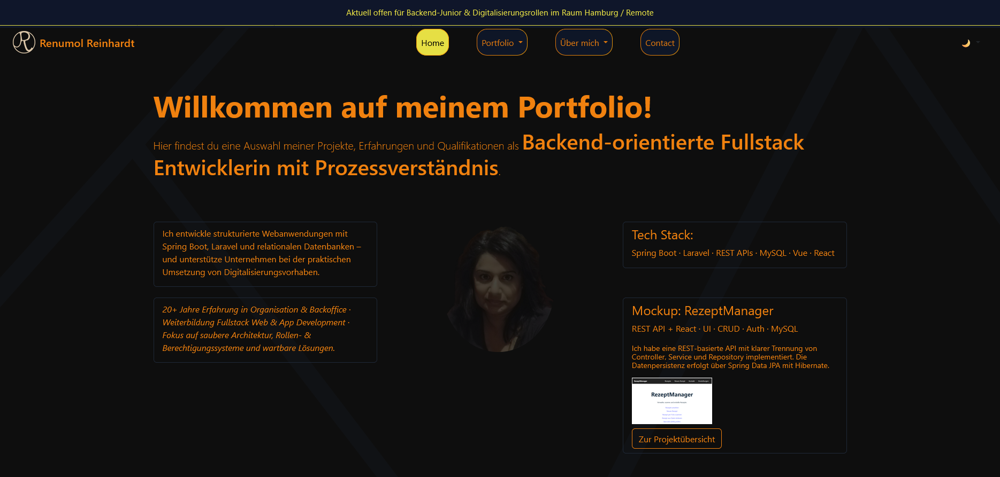
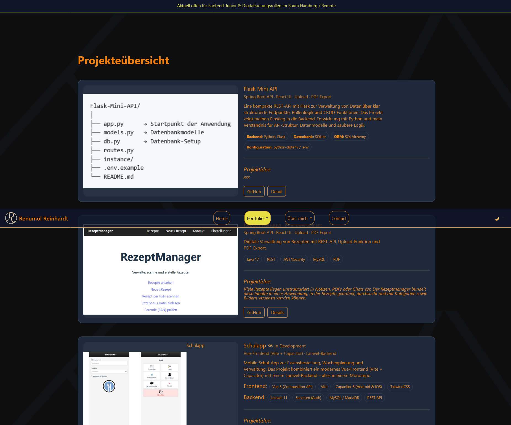

#

## ⚠️ Diese Website befindet sich noch im Aufbau und wird laufend erweitert. Vielen Dank für dein Verständnis.
This website is still under construction and will be continuously updated. Thank you for your understanding.

Dieses Repository enthält meine persönliche **Portfolio-Website** , auf der ich Projekte, technische Fähigkeiten und meinen beruflichen Hintergrund vorstelle.

Der Schwerpunkt liegt auf **backend-orientierter Fullstack-Entwicklung**, strukturierten Webanwendungen und praktischen Digitalisierungsprojekten.

Die Projekte demonstrieren unter anderem den Einsatz von **Spring Boot, Laravel, React, Vue und Flask**.

## 🚀 Live-Demo

👉 [Live-Version auf GitHub Pages](https://renor-711.github.io/Portfolio-Website/)

## 🔧 Verwendete Technologien

- HTML5
- CSS3 (Flexbox, Grid)
- JavaScript (Formularvalidierung, interaktive Elemente)

## 🖥️ Funktionen

- Responsive Layout für Mobil, Tablet und Desktop
- Übersicht meiner Entwicklungsprojekte
- Projektseiten mit Beschreibung und Tech-Stack
- Dark / Light / Blue Theme Umschaltung
- Kontaktformular mit JavaScript-Validierung
- Galerie mit Lightbox-Effekt
- Interaktive UI-Elemente (Hover-Effekte, Animationen)
- Links zu GitHub-Repos und Live-Demos
  
## 🧠 Ausgewählte Projekte

| Projekt         | Beschreibung                                                       | Technologien              |
| --------------- | ------------------------------------------------------------------ | ------------------------- |
| Flask Mini API  | REST-API mit CRUD-Endpunkten und Rollenlogik                       | Python, Flask, SQLAlchemy |
| RezeptManager   | Webanwendung zur Verwaltung von Rezepten mit Upload und PDF-Export | Spring Boot, React, MySQL |
| SchulApp        | Mobile Schul-App mit Vue-Frontend und Laravel-Backend              | Vue, Capacitor, Laravel   |
| Travel Planner  | Reiseplaner mit Dashboard, Packliste und Bucket-List               | React, TypeScript         |
| Markdown Editor | Minimaler Markdown-Editor mit Live-Vorschau                        | React, Vite               |
| NoteApp         | Android-Notiz-App                                                  | Kotlin, Android           |

## 📸 Screenshots

## 📂 Projektstruktur

portfolio
│
├── index.html
├── README.md
│
├── assets
│ ├── css
│ ├── images
│ └── js
│
├── projekte
│ └── fullstack.html
│
├── aboutme
├── career
├── education
└── zertifikate

## 👩‍💻 Autorin

**Renumol Reinhardt**

*Backend-orientierte Fullstack Entwicklerin* |
*Schwerpunkt: Webanwendungen, APIs und Digitalisierung*
